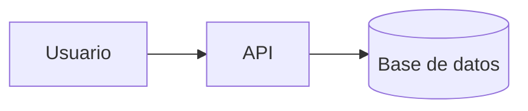

# vivelagocalima by diego cabezas
 

  <a href="#instalación">Instalación</a> •
  <a href="#uso">Uso</a> •
  <a href="#contribuir">Contribuir</a> •
  <a href="#licencia">Licencia</a>

```mermaid
graph LR
  A[Usuario] --> B[API]
  B --> C[(Base de datos)]
```
